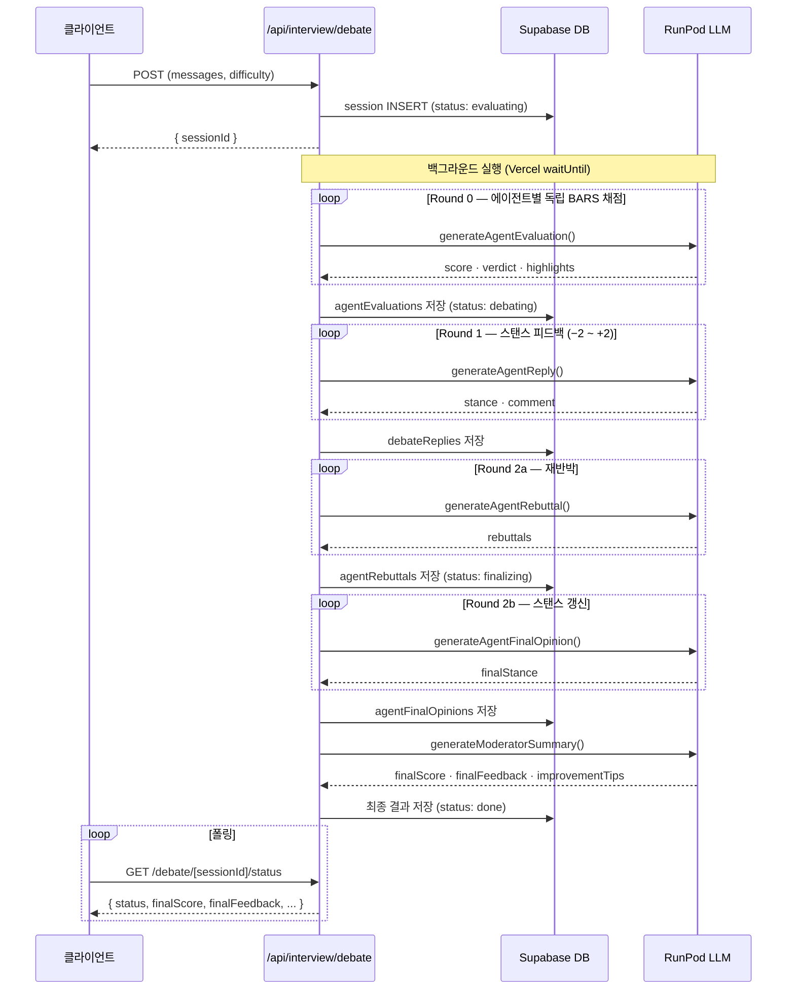
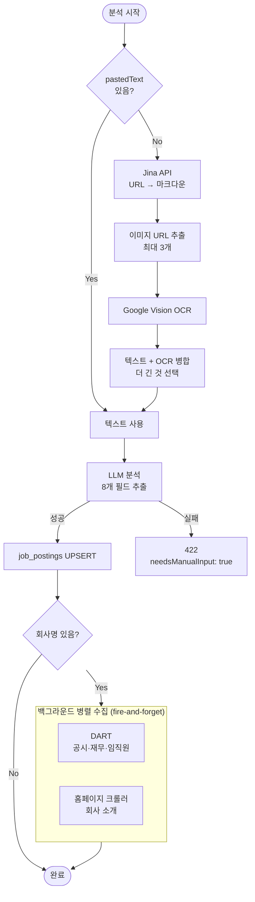
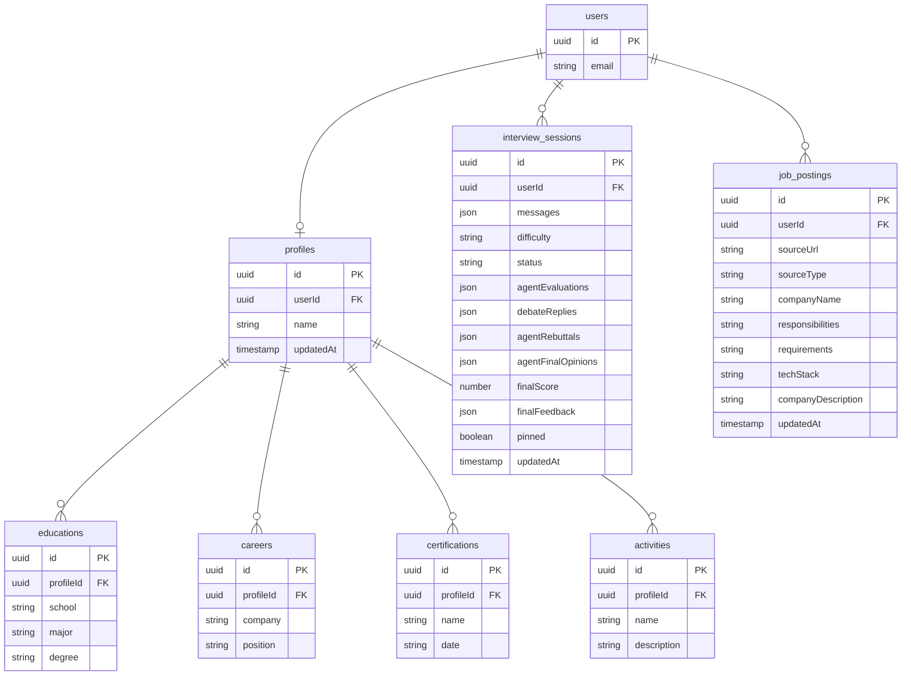

# 플로우 다이어그램

## 전체 흐름

```
채용공고 입력
    │
    ▼
채용공고 분석 (Jina + OCR + LLM)
    │
    ├──────────────────────────────────┐
    │                                  │
    ▼ (비동기)                         ▼ (면접 시작 시)
DART 기업정보 수집                    뉴스 크롤링
(6개월 캐싱)                          (normal/hard만)
    │                                  │
    └──────────────┬───────────────────┘
                   │
                   ▼
            면접 진행 (3 에이전트)
            Organization → Logic → Technical
            각 에이전트: 기본 질문 → 꼬리질문(0~3회)
                   │
                   ▼
            토론 (4 라운드)
            Round 0: 독립 평가
            Round 1: 상호 피드백
            Round 2: 재반박
            Round 3: 최종 의견
                   │
                   ▼
            중재자 종합 점수 및 피드백
```

---

## 면접 평가 플로우



---

## 채용공고 분석 플로우



---

## DB 스키마


